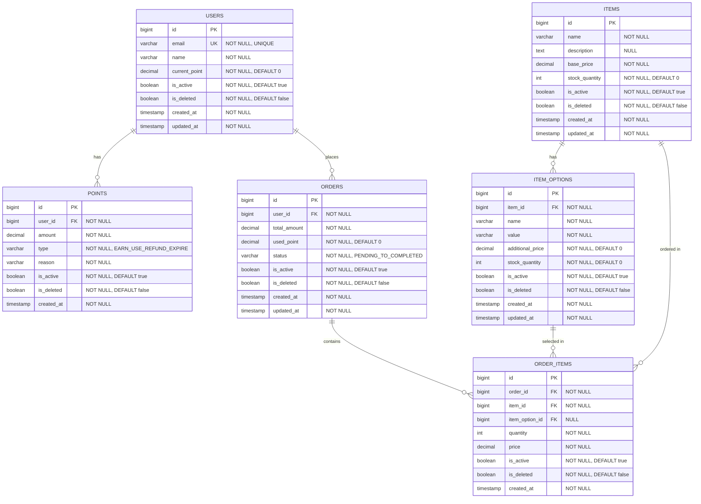

# E-Commerce System ERD

## Entity Relationship Diagram



## Relationship Details

### User Relationships
- **User → Point**: 1:N (한 사용자는 여러 포인트 거래 내역을 가질 수 있음)
- **User → Order**: 1:N (한 사용자는 여러 주문을 할 수 있음)

### Item Relationships
- **Item → ItemOption**: 1:N (한 상품은 여러 옵션을 가질 수 있음)
  - Cascade: ALL
  - OrphanRemoval: true
- **Item → OrderItem**: 1:N (한 상품은 여러 주문에 포함될 수 있음)

### Order Relationships
- **Order → OrderItem**: 1:N (한 주문은 여러 주문 상품을 포함함)

### ItemOption Relationships
- **ItemOption → OrderItem**: 1:N (한 옵션은 여러 주문에서 선택될 수 있음)
- **ItemOption → Item**: N:1 (여러 옵션은 하나의 상품에 속함)

## Business Rules

### Point System
- 포인트는 적립(EARN), 사용(USE), 환불(REFUND), 소멸(EXPIRE) 4가지 타입으로 관리
- User 테이블의 `current_point`는 현재 사용 가능한 포인트 잔액

### Stock Management
- Item: 기본 상품 재고
- ItemOption: 옵션별 독립 재고 관리
- 주문 시 재고 감소 필수 검증

### Order Flow
```
PENDING → CONFIRMED → SHIPPED → COMPLETED
    ↓
CANCELLED
```

### Price Calculation
- **Item 가격**: `base_price`
- **ItemOption 가격**: `base_price + additional_price`
- **Order 최종 가격**: `total_amount - used_point`

## Index Recommendations

```sql
-- User
CREATE INDEX idx_users_email ON users(email);
CREATE INDEX idx_users_active ON users(is_active, is_deleted);

-- Point
CREATE INDEX idx_points_user_id ON points(user_id);
CREATE INDEX idx_points_created_at ON points(created_at);

-- Item
CREATE INDEX idx_items_active ON items(is_active, is_deleted);

-- ItemOption
CREATE INDEX idx_item_options_item_id ON item_options(item_id);

-- Order
CREATE INDEX idx_orders_user_id ON orders(user_id);
CREATE INDEX idx_orders_status ON orders(status);
CREATE INDEX idx_orders_created_at ON orders(created_at);

-- OrderItem
CREATE INDEX idx_order_items_order_id ON order_items(order_id);
CREATE INDEX idx_order_items_item_id ON order_items(item_id);
```

## Notes

- 모든 테이블에 `is_active`, `is_deleted` 소프트 삭제 플래그 적용
- 모든 금액 필드는 `decimal(10,0)` 타입 사용 (정수 금액)
- Lazy Loading을 위해 연관관계는 기본적으로 `FetchType.LAZY` 사용
- 양방향 연관관계는 Item ↔ ItemOption에만 적용
