# Mermaid ERD 문법 가이드

## 기본 구조

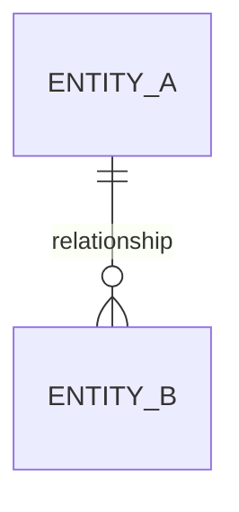

## 1. 관계 표현 (Cardinality)

### 기호 설명
| 기호 | 의미 | 설명 |
|------|------|------|
| `\|o` | Zero or one | 0 또는 1 |
| `\|\|` | Exactly one | 정확히 1 |
| `}o` | Zero or more | 0 또는 다수 |
| `}\|` | One or more | 1 또는 다수 |

### 관계 조합 예시

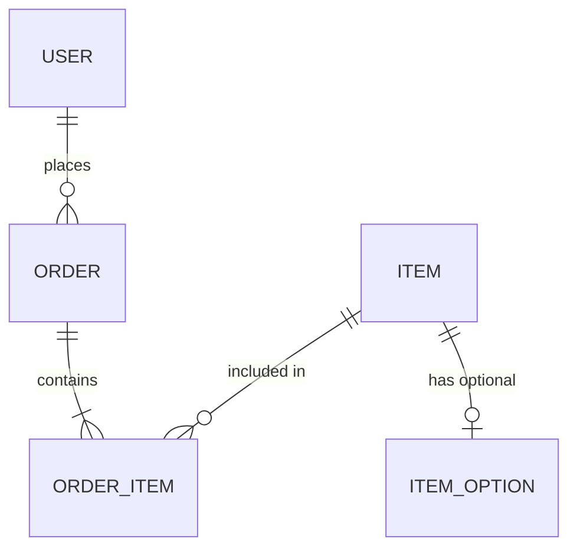

#### 관계 해석
- `||--o{` : 1:N (One to Many)
  - 왼쪽 엔티티 1개가 오른쪽 엔티티 0개 이상과 관계
  - 예: `USER ||--o{ ORDER` (한 사용자는 0개 이상의 주문을 가짐)

- `||--|{` : 1:N (One to Many, 필수)
  - 왼쪽 엔티티 1개가 오른쪽 엔티티 1개 이상과 관계
  - 예: `ORDER ||--|{ ORDER_ITEM` (한 주문은 최소 1개 이상의 상품을 포함)

- `}o--||` : N:1 (Many to One)
  - 왼쪽 엔티티 0개 이상이 오른쪽 엔티티 1개와 관계
  - 예: `ORDER_ITEM }o--|| ORDER` (여러 주문상품은 하나의 주문에 속함)

- `||--||` : 1:1 (One to One)
  - 양쪽 엔티티가 정확히 1:1 관계
  - 예: `USER ||--|| USER_PROFILE` (사용자는 정확히 하나의 프로필)

- `||--o|` : 1:0..1 (One to Zero or One)
  - 왼쪽 엔티티 1개가 오른쪽 엔티티 0 또는 1개와 관계
  - 예: `ORDER ||--o| PAYMENT` (주문은 결제가 있을 수도, 없을 수도)

## 2. 엔티티 속성 정의

### 기본 문법

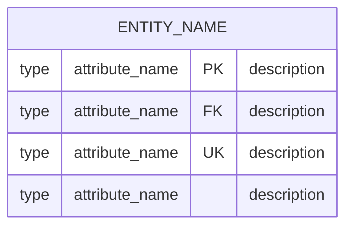

### 키 타입
- `PK` : Primary Key (기본 키)
- `FK` : Foreign Key (외래 키)
- `UK` : Unique Key (고유 키)

### 예시

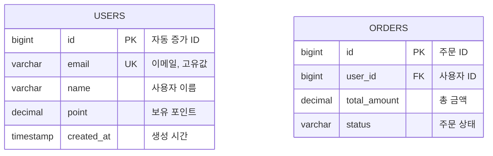

## 3. 데이터 타입

### 일반적인 데이터 타입
- `bigint` : 큰 정수 (Long)
- `int` : 정수 (Integer)
- `varchar` : 가변 길이 문자열
- `text` : 긴 텍스트
- `decimal` : 정확한 소수점 숫자
- `boolean` : 참/거짓
- `timestamp` : 날짜와 시간
- `date` : 날짜만
- `time` : 시간만

### ⚠️ 주의사항: Mermaid 제약

**사용 불가:**
```
decimal(10,0)  ❌ 괄호 포함 시 파싱 오류
varchar(100)   ❌ 괄호 포함 시 파싱 오류
```

**사용 가능:**
```
decimal  ✅ 괄호 제거
varchar  ✅ 괄호 제거
```

## 4. 완전한 ERD 예시

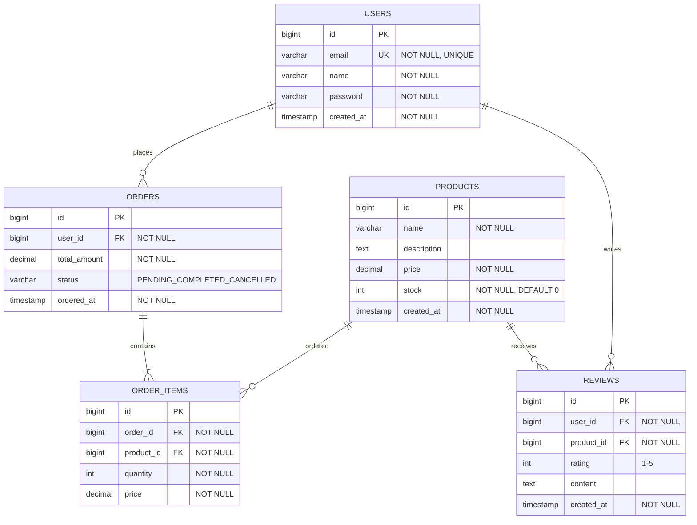

## 5. 관계 방향성

### 왼쪽에서 오른쪽으로 읽기

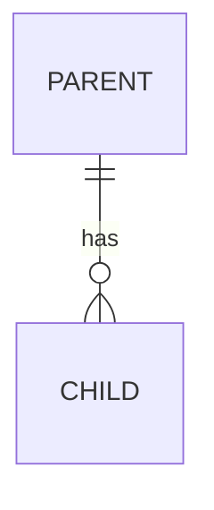

**해석:** PARENT는 CHILD를 가진다 (has)
- PARENT 1개 → CHILD 0개 이상

### 오른쪽에서 왼쪽으로 읽기

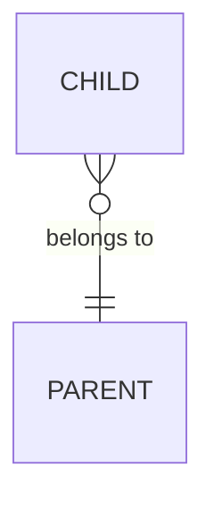

**해석:** CHILD는 PARENT에 속한다 (belongs to)
- CHILD 0개 이상 → PARENT 1개

## 6. 실전 패턴

### 패턴 1: 사용자-주문 (1:N)
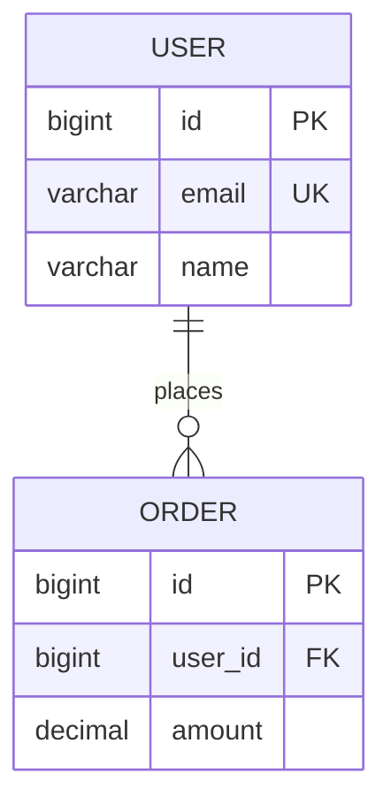

### 패턴 2: 주문-상품 (M:N with 중간 테이블)
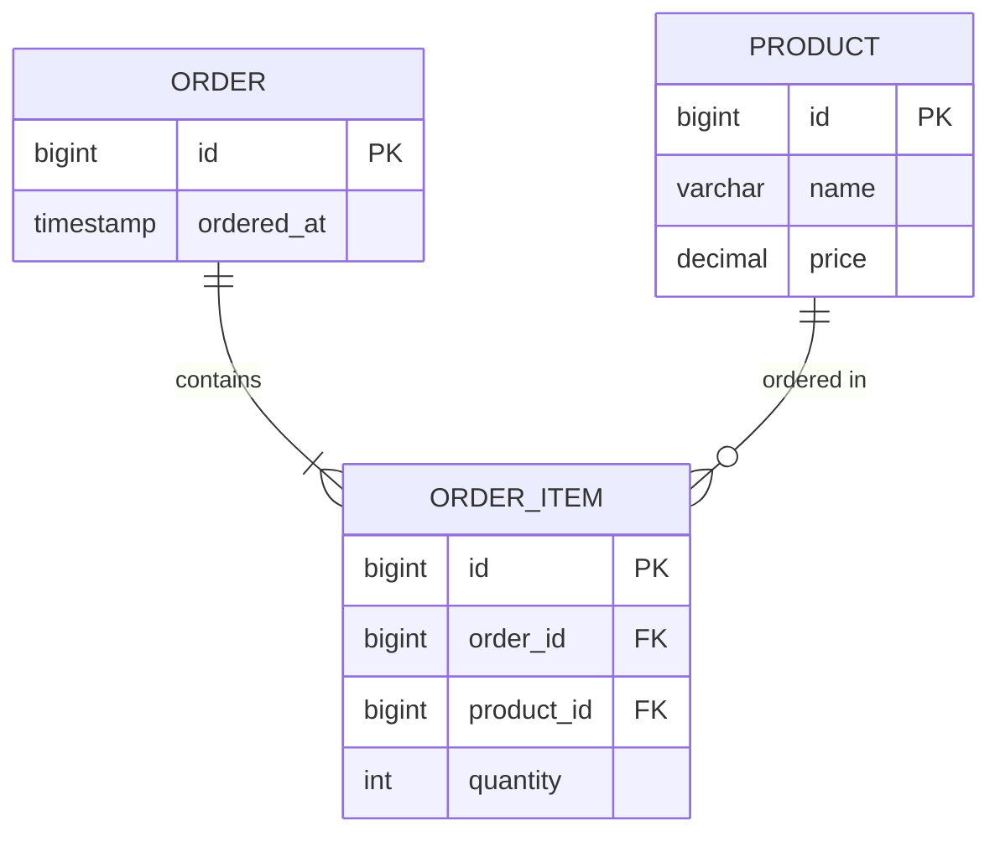

### 패턴 3: 상품-옵션 (1:N, Cascade)
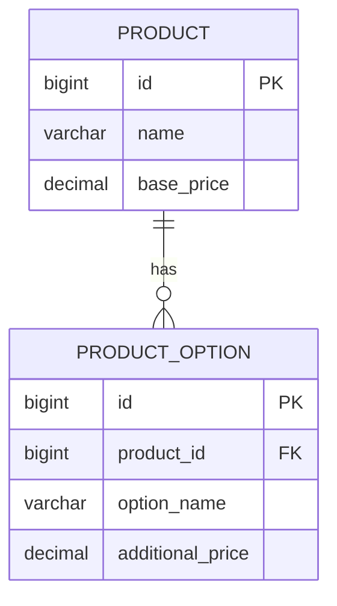

### 패턴 4: 상속 관계 (Single Table)
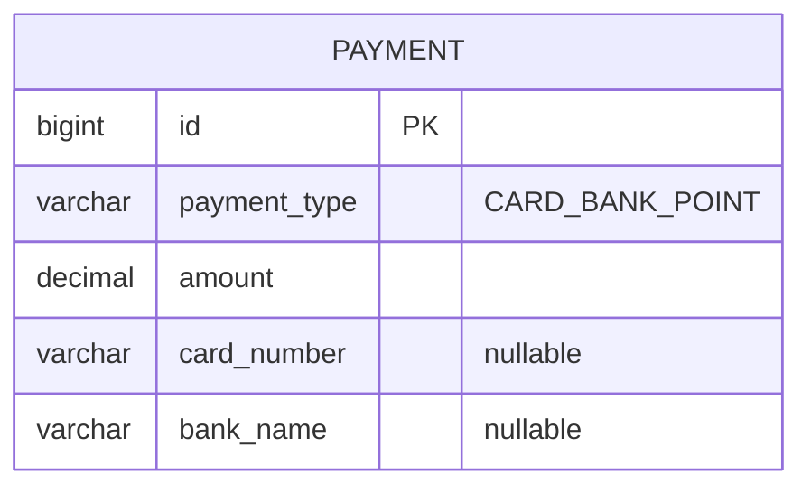

## 7. 베스트 프랙티스

### ✅ 좋은 예시

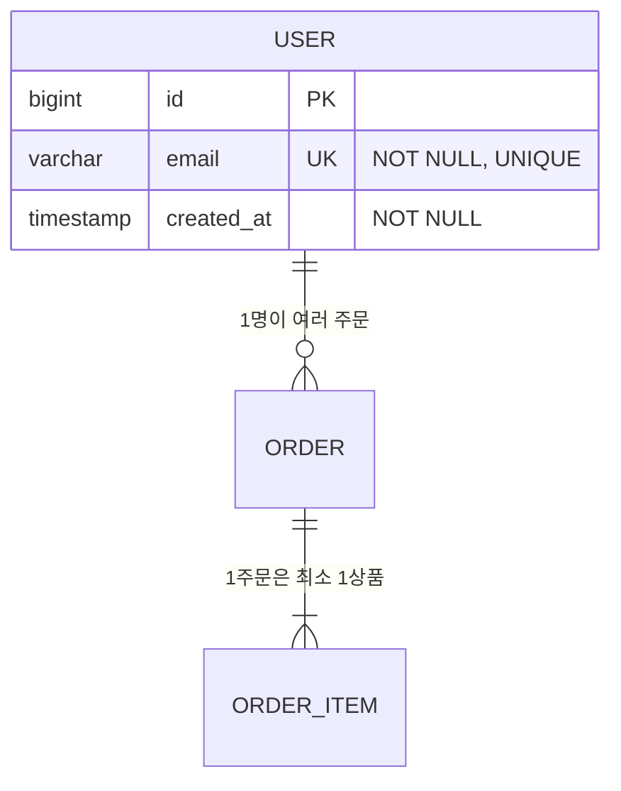

**장점:**
- 명확한 관계 설명
- 제약조건 명시
- 읽기 쉬운 한글 설명

### ❌ 나쁜 예시

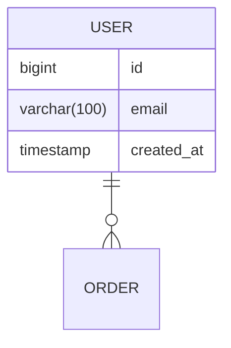

**문제점:**
- 관계 설명 누락
- 괄호 사용으로 파싱 오류
- 제약조건 미명시

## 8. 디버깅 팁

### 문제: ERD가 렌더링 안 됨

**원인 1: 괄호 사용**
```
decimal(10,0)  ❌
varchar(255)   ❌
```

**해결:**
```
decimal  ✅
varchar  ✅
```

**원인 2: 특수문자**
```
"NOT NULL, DEFAULT 0"  ❌ (쉼표가 문제)
"ENUM: A|B|C"          ❌ (파이프가 문제)
```

**해결:**
```
"NOT NULL DEFAULT 0"  ✅
"ENUM_A_B_C"          ✅
```

**원인 3: 잘못된 관계 기호**
```
USER ---> ORDER  ❌ (화살표 사용 불가)
```

**해결:**
```
USER ||--o{ ORDER  ✅
```

## 9. 추가 다이어그램 타입

### Flowchart (흐름도)
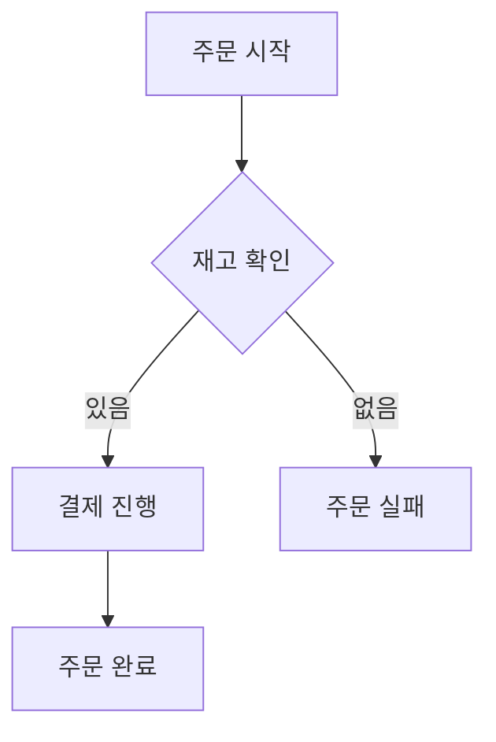

### Sequence Diagram (시퀀스)
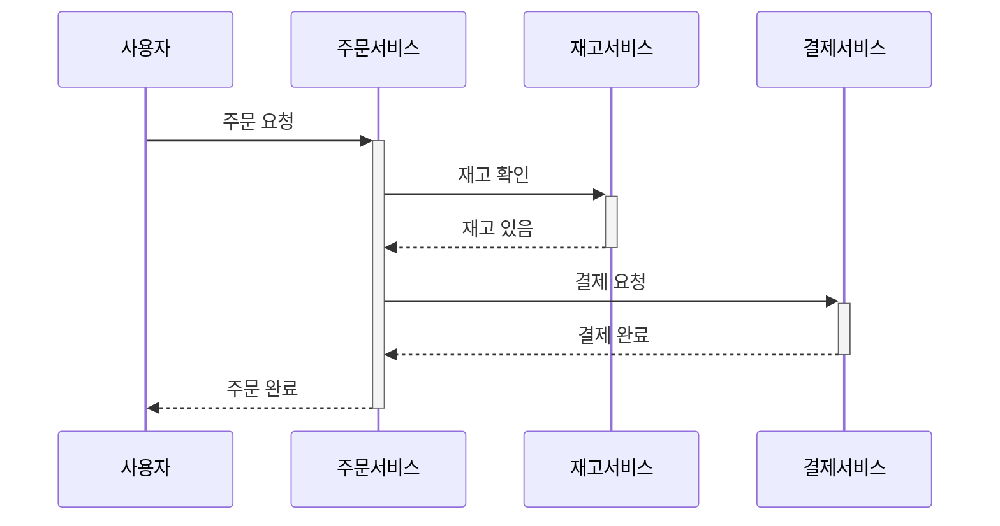

### Class Diagram (클래스)
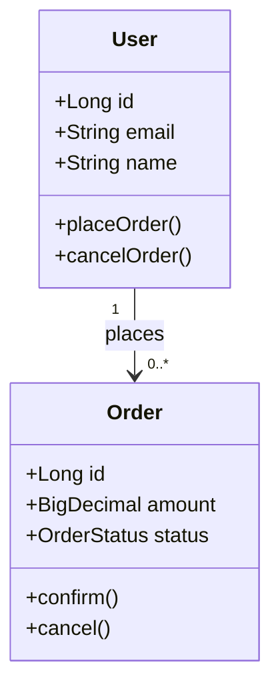

## 10. 참고 자료

- [Mermaid 공식 문서](https://mermaid.js.org/)
- [ERD 문법](https://mermaid.js.org/syntax/entityRelationshipDiagram.html)
- [Mermaid Live Editor](https://mermaid.live/) - 실시간 테스트

## 요약

1. **관계 표현**: `||--o{`, `||--|{`, `}o--||` 등으로 카디널리티 표현
2. **속성 정의**: PK, FK, UK로 키 타입 명시
3. **타입 주의**: 괄호, 쉼표 사용 자제
4. **설명 추가**: 관계와 속성에 한글 설명 권장
5. **실시간 테스트**: Mermaid Live Editor 활용
